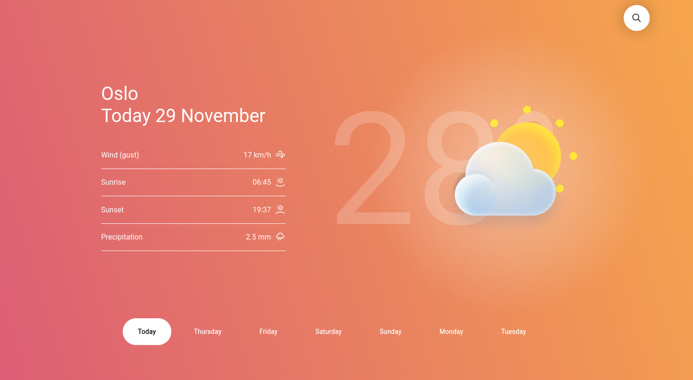

<h1 align="center">weatherbit</h1>
<h5 align="center">
    A simple weather forecast website that leverages the weatherbit.io API
</h5>
<br />
<p align="center">
    
</p>
<br />

### Project Structure

```shell

.
├── workspace         # Notes, design files and random documents
└── www
    ├── assets
    │   ├── img
    │   └── svg
    ├── css           # Do not modify the files within this directory.
    │   └── main.css
    ├── index.html    # Entry point of the project (main markup)
    ├── js
    │   └── index.js
    ├── php
    └── scss          # Page styling goes in here
        ├── base
        ├── layouts
        ├── pages
        └── main.scss # gets compiled to `www/css/main.css`

```
